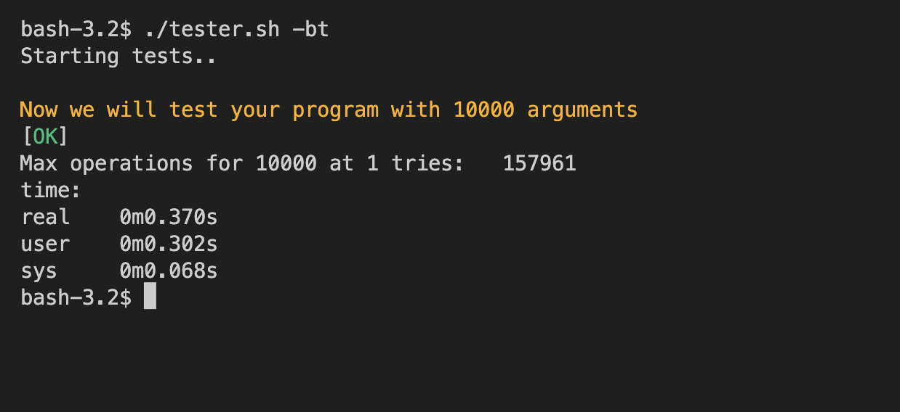

# Tester for push_swap

This project is created to alow a stand-alone import of my tester instead of only distributing it through my push_swap project.

## Config

In the tester.sh


## Usage

run:
```bash
./tester.sh [-ptriba] [-c <amount-of-args>]
```

### Options

The following options are available:

-p 		: pipeline (exit 1 on KO)
-t		: timed (10.000 args)
-r		: random tests (completely made up, feel free to extend tehm for yourself!)
-i		: input tests (very limited, also feel free to extend for yourself!)
-b 		: benchmarking (amount of operations)
-a		: overwrite the amount of rounds int he config file for benchmarking
-c X	: check X amount of arguments

When no options are selected you receive the complimentary full test I use on evaluations.

## Exit
1. Pipeline (option -p) turned on and KO received.
2. Invalid option.

## Challenge

A fellow student once told me he could sort 500 numbers by hand, it is peanuts to sort such low numbers!
To make the project more interesting he came up with a challenge.
Sort 10.000 arguments, randomly created. The challenge has only two goals, both equally important:
 - You must keep the total number of operations low.
 - Your program should run as quickly as possible!

With these two objectives in mind I made a special check in this tester (options -bt).
Below are my scores, if you can beat me on both let me know on slack!



